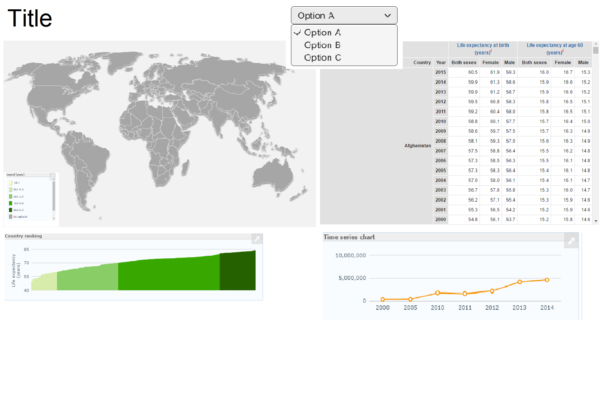

# Project
Programmeerproject om een datavisualisatie te maken over de luchtkwaliteit en de gevolgen daarvan per land.

Saskia Valstar 
s11423404

Het doel is om het belang van een schone lucht te laten zien. Onlangs verscheen een artikel dat het gebruik van open haarden niet zonder risico’s is vanwege fijnstof die bij het verbranden van hout vrijkomt. In veel landen is wordt er nog in huis hout verbrandt om te koken en te verwarmen zonder de aanwezigheid van een schoorsteen of goede ventilatie. Dat zorgt voor veel nadelige effecten voor de gezondheid van die mensen. Om dat in beeld te brengen laat ik een wereldkaart zien met de luchtkwaliteit en het percentage dat nog binnenshuis hout en/of kolen verbrandt. De gegevens zijn afkomstig van de WHO-databases van de Global Healt Observatory data. 

Er zijn verschillende onderdelen van de visualisatie: de wereldkaart kan meerdere variabelen laten zien door middel van een drop down menu. Daarbij komt er bar chart tevoorschijn om te zien hoe dit land ten opzichte van de rest van de wereld het doet (met dezelfde data als de wereldkaart) en een line graph van de afgelopen jaren. Daarnaast kun je in een taartdiagram zien hoe de verdeling van de ziektes is om te onderzoeken wat voor invloed de luchtkwaliteit heeft op het voorkomen van bepaalde soort ziektes.   
Waar rekening mee gehouden moet worden, is het gebruik van verschillende datasets en het linken van die data. Hierdoor moet van te voren goed bedacht worden hoe de grafieken en tabellen onderling met elkaar verbonden moeten zijn. Bovendien moet er bij het gebruik van meerdere datasets worden opgelet of er verschillende landnamen worden gebruikt, want in dat geval kunnen de landcodes misschien niet overeenkomen en kan het linken niet plaatsvinden. 

http://gamapserver.who.int/gho/interactive_charts/mbd/life_expectancy/atlas.html laat zien wat ik voor ogen heb, ik wil alleen allerlei datasets combineren om een completer overzicht te geven. Daarbij vind ik de tabel met alle data van alle landen niet heel nuttig om zo groot te weergeven, die zou ik vervangen door een tabel per land.  

De volgende onderdelen zullen worden weergegeven op de datavisualisatie:
- Wereldkaart met concentratie fijnstof of percentage dat kookt met hout/kolen (kiezen mbv dropdown)
- Staafdiagram met alle landen op een rij om te zien hoe het land het ten opzichte van de rest van de wereld doet 
- Taartdiagram met de verdeling van de soorten ziektes (per land verschillend)
- Scatterplot met concentratie fijnstof vergeleken met het sterftecijfer door verslechterde luchtkwaliteit (licht op als je op het land klikt) 
- Tijdlijn met de verbetering/verslechtering van de luchtkwaliteit (evt met een sleepmechanisme)

Hieronder een voorlopige en een uitgebreidere schets van hoe ik hoop dat het eruit gaat zien. 

